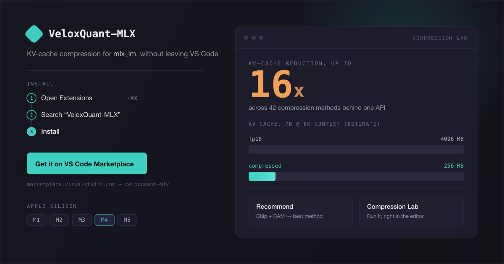

<p align="center">
  
</p>

# VeloxQuant-MLX for VS Code

[](https://open-vsx.org/extension/veloxquant-mlx/veloxquant-vscode)
[](https://open-vsx.org/extension/veloxquant-mlx/veloxquant-vscode)

Recommend a KV-cache compression method for your Mac and model, and run the
[VeloxQuant-MLX](https://github.com/rajveer43/VeloxQuant-MLX) compression lab
— without leaving VS Code.

[VeloxQuant-MLX](https://github.com/rajveer43/VeloxQuant-MLX) shrinks the KV
cache of `mlx_lm` models on Apple Silicon, up to 16x, via 43 compression
methods behind one API. This extension is a thin client over the package's
own `recommend` CLI and local control-plane server — it does not reimplement
any compression logic.

## Features

### Recommend & Insert

A dedicated sidebar (its own Activity Bar icon) with a form for chip, RAM,
model class, and goal. Submitting it runs
`python -m veloxquant_mlx recommend --json` using whichever interpreter is
selected in the Python extension (or `veloxquant.pythonPath` if you set one),
and renders:

- The recommended method, headline compression ratio, and — just as
  prominently — whether that compression is likely to show up as **lower
  live RAM usage** or is **accounting-only** (many methods still materialize
  full-precision tensors internally; the package's own docs are explicit
  about this, and this extension will not round that nuance off).
- Warnings and rationale straight from the CLI.
- An **Insert into editor** button that writes a ready-to-use
  `KVCacheConfig(...)` snippet at your cursor (or offers a picker across
  open Python files, or falls back to your clipboard).
- A **Copy CLI command** button so you can reproduce the exact call in a
  terminal or notebook.

An **Advanced** section adds optional sequence length, layer count, KV head
count, head dimension, and batch size overrides — the same workload shape
`select_kv_cache_config()`'s `WorkloadSpec` takes upstream. When the active
(or first open) Python file has a recognizable model-load call (e.g.
`AutoModelForCausalLM.from_pretrained(...)`, `mlx_lm.load(...)`) with layer
count or head dimension spelled out literally in its arguments, an **Infer
from active file** button appears to fill those two fields in for you; it's
a text scan, not a model download, so it only fills in what's already
written in your source.

Hardware detection (chip + RAM) prefills the form on Apple Silicon Macs when
`veloxquant.autoDetectHardware` is on; it never blocks the form if detection
fails.

### Compression Lab

Command **VeloxQuant-MLX: Open Compression Lab**, or its own Activity Bar
icon. Opens an editor-area panel backed by the package's own local
control-plane server (`python -m veloxquant_mlx panel --port <port>
--no-browser`), reusing an already-running instance instead of spawning a
duplicate. If the local package isn't available, a **Use hosted version
instead** button opens the hosted playground in your system browser.

The local server can also start/stop a real `mlx_lm` inference process. If
this extension spawned the panel process and an inference server is still
running when you close the Compression Lab panel, you'll be asked before
anything is stopped.

While an inference server started from the Compression Lab is running, a
status bar item shows its method and port. Hovering it also shows the
server process's measured RSS (via the control panel's `/api/memory`,
clearly separate from the accounting-only compression ratios shown
elsewhere), and it links to command **VeloxQuant-MLX: Stop Inference
Server**. Clicking the item reopens the Compression Lab panel. The
server's stdout/stderr are also tailed live into an output channel named
**VeloxQuant-MLX Inference Server** (View → Output), separate from the
**VeloxQuant-MLX Panel** channel, which only carries the control-plane
process's own logs.

### Chat Playground

Command **VeloxQuant-MLX: Open Chat Playground**. A second editor-area panel,
alongside the Compression Lab, that loads a local model through
`@veloxquant/sdk` directly (not the CLI) and lets you chat with it, streaming
tokens live. Pick a downloaded model or type a Hugging Face model id, choose
automatic method selection or an explicit serving-compatible method, send a
message, and stop generation mid-stream without killing the loaded model.
Closing the panel stops the underlying model process.

An **Agent mode** toggle switches the same chat surface to use the SDK's
tool-calling `Agent`, with two read-only, editor-native example tools:
`read_active_file` (the active editor's path and content) and
`list_workspace_files` (glob-matched workspace paths, respecting
`.gitignore`/`files.exclude`). Tool calls render as expandable "used tool: …"
entries in the transcript, distinct from the model's own text. There is
deliberately no file-write or shell-exec tool — that needs its own
confirmation-and-sandboxing design.

The model process's stdout/stderr are tailed live into an output channel
named **VeloxQuant-MLX Chat**, separate from the Compression Lab's own
channels.

### Local Models

A tree view (in the Compression Lab activity bar container) listing model
weights already downloaded to your local Hugging Face cache — id, size, and
last-used time. **Pull new model** downloads a model by Hugging Face id with
an indeterminate progress notification (downloads have no timeout — they can
take many minutes). Deleting a model asks for confirmation first, since
freed weights aren't recoverable without re-downloading.

### Benchmark Model

Command **VeloxQuant-MLX: Benchmark Model**. Runs the SDK's `benchmark()`
against a model you pick (from your local cache, or a free-text id),
comparing tokens/sec, time-to-first-token, and measured resident memory
(RSS) between the default method and an automatic or explicitly selected
optimized method. This takes minutes —
it loads the model twice — and reports progress via a notification and the
**VeloxQuant-MLX Benchmark** output channel. Results open as an untitled
Markdown document, including the same accounting-only caveat line the SDK
itself produces when optimized RSS measures higher than the default (yes,
that can happen — compression byte-count savings and measured resident
memory are not the same thing).

### Profile Model

Command **VeloxQuant-MLX: Profile Model** runs the package's supported
`veloxquant profile` CLI against a model and servable method. It renders the
schema-versioned per-layer latency, byte counters, accounting compression
ratio, and throughput report as Markdown. Profiling loads its own model, so
the extension requires Compression Lab and Chat models to be stopped first.

### Diagnostics

Command **VeloxQuant-MLX: Run Diagnostics** starts the package's short-lived
worker protocol, reports Python/VeloxQuant/MLX/device versions and supported
operations, and executes a small Metal probe. The worker is always stopped
when the report finishes or fails.

## Requirements

- macOS on Apple Silicon (M1–M5) to actually run compression — the
  extension activates cross-platform (e.g. over Remote-SSH into a Mac) but
  will show an upfront notice rather than pretend the library works
  elsewhere.
- Python with `VeloxQuant-MLX` installed, resolved via the
  [Python extension](https://marketplace.visualstudio.com/items?itemName=ms-python.python)
  or `veloxquant.pythonPath`.
- VeloxQuant-MLX requirements are checked per feature: **0.42.0** for
  Recommend, **0.46.0** for the panel/serve paths, **0.68.0** for profiling,
  and **0.81.0** for worker diagnostics. **0.83.0 or newer is recommended**
  for current cache, live-memory, and dynamic-field fixes.

The Chat Playground, Local Models, and Benchmark Model features additionally
depend on [`@veloxquant/sdk`](https://www.npmjs.com/package/@veloxquant/sdk)
(bundled as this extension's first runtime npm dependency) — no separate
install step for you, but worth knowing if you're auditing what this
extension pulls in.

Install the package:

```
pip install VeloxQuant-MLX
```

(The extension can also do this for you from an inline "Install
VeloxQuant-MLX" button when it detects the package is missing.)

## Settings

| Setting | Default | Description |
| --- | --- | --- |
| `veloxquant.pythonPath` | `""` | Explicit interpreter path. Leave blank to use the Python extension's active interpreter. |
| `veloxquant.panelPort` | `7860` | Port for the local control-plane server. Always loopback (`127.0.0.1`) — there is no setting to change that host. |
| `veloxquant.autoDetectHardware` | `true` | Prefill chip/RAM in the Recommend form from detected hardware. |

## Not (yet) included

- No CodeLens/hover/IntelliSense on `KVCacheConfig(...)` call sites, no
  custom language server.
- No bundling of the `VeloxQuant-MLX` Python package inside the extension —
  this is a thin client over a user-managed Python environment.
- Hub search remains inside the package-owned Compression Lab; the extension's
  Local Models view supports explicit pull/delete operations by model id.
- No account system, no non-standard telemetry (VS Code's own opt-in/opt-out
  telemetry API only).
- No Windows/Linux feature parity claims — the extension can activate
  cross-platform but does not claim the underlying library works there.

## Development

```
npm install
npm run compile      # type check
npm run lint
npm run test:unit    # node:test, pure logic (snippet builder, argv building, version check)
npm run build        # esbuild bundle to dist/
npm run test:integration  # @vscode/test-electron, spins up a real VS Code instance
npm run package       # vsce package (dry run, does not publish)
```

`test:integration` launches a real Electron-based VS Code instance and will
not run in a headless/sandboxed shell without GUI session access (it needs
window server access on macOS or a virtual display like Xvfb on Linux CI).
The scaffolding under `test/suite/` is real and passes locally in a normal
desktop terminal; it is pinned to VS Code 1.85.2 for launcher compatibility.

## Releasing

Normal releases are fully automated — see [CONTRIBUTING.md](CONTRIBUTING.md).
Merging Conventional Commits into `master` lets
[release-please](https://github.com/googleapis/release-please) open a
Release PR; merging that PR tags, builds, and publishes to both the VS Code
Marketplace and Open VSX automatically via
[`.github/workflows/release-please.yml`](.github/workflows/release-please.yml).

The steps below are for the rare case you need to publish by hand (e.g. the
CI publish job failed partway and a version is already live on one
registry, or a registry needs one-time setup).

### One-time setup

Both `vsce` and `ovsx` read their token from the `-p` flag. Export them as
env vars locally so you never have to type them inline:

```
export VSCE_PAT=<Azure DevOps PAT, Marketplace scope = Manage>
export OVSX_PAT=<Open VSX access token, from open-vsx.org -> Profile -> Access Tokens>
```

Open VSX also requires the publisher namespace to exist before the first
publish — this is separate from having a valid token:

```
npx ovsx create-namespace veloxquant-mlx -p "$OVSX_PAT"
```

(Safe to re-run — it errors with "Namespace already exists" if already
created, which is fine.)

### Build the package

From `master`, at the commit/tag you want to publish:

```
npm ci
npm run build
npx vsce package --no-dependencies -o release.vsix
```

### Publish

```
npx vsce publish --packagePath release.vsix -p "$VSCE_PAT"
npx ovsx publish release.vsix -p "$OVSX_PAT"
```

`vsce publish` is not idempotent — it fails loudly (`vX.Y.Z already exists`)
if that exact version is already live on the Marketplace. If Marketplace
succeeded but Open VSX didn't (or vice versa), just re-run the one that
still needs it.

### Attach the `.vsix` to the GitHub Release

```
gh release upload vX.Y.Z release.vsix --repo rajveer43/veloxquant-vscode
```

Replace `vX.Y.Z` with the tag release-please already created for that
version (the release must exist first — release-please creates it when its
PR is merged).

**Never paste a real token value into a chat/AI assistant, a commit, or any
file that gets committed.** If a token is ever exposed that way, revoke it
immediately on open-vsx.org / Azure DevOps and update the corresponding
GitHub Actions secret (`OVSX_PAT` / `VSCE_PAT`).

## Links

- Main project: https://github.com/rajveer43/VeloxQuant-MLX
- Issues: https://github.com/rajveer43/veloxquant-vscode/issues
- VS Code Marketplace: https://marketplace.visualstudio.com/items?itemName=veloxquant-mlx.veloxquant-vscode
- Open VSX Registry: https://open-vsx.org/extension/veloxquant-mlx/veloxquant-vscode

## License

MIT
